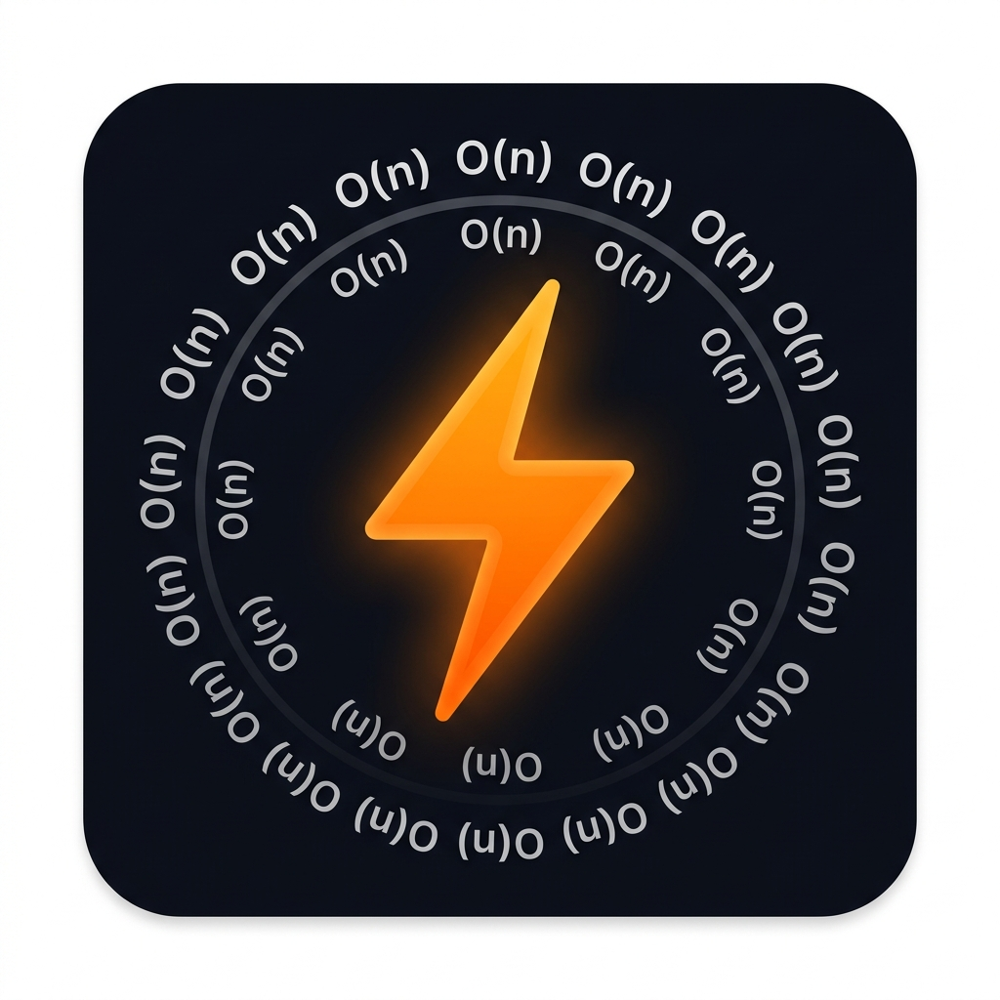

# ⚡ LeetCode Complexity Insight

A Chrome extension that automatically analyzes your LeetCode submissions for **time and space complexity**, detects algorithmic patterns, and suggests better approaches — all in **plain English, never showing code**.



---

## ✨ Features

- 🔍 **Complexity Analysis** — Instant Big-O estimates with human-readable reasoning
- 💡 **Approach Suggestions** — Named techniques (Two Pointer, Sliding Window, DP…) explained conceptually, no code ever shown
- 📋 **Submission Metadata** — Verdict, runtime, memory, and LeetCode percentile stats
- 🕰️ **History** — Cached analyses per problem/language, accessible anytime
- 🎨 **Dark/Light Theme** — Matches LeetCode's aesthetic
- 🔒 **Privacy First** — Your API key stays local; only code snippets are sent for analysis

---

## 🚀 Installation

### 1. Clone or Download
```
git clone https://github.com/yourusername/leet_code_analyzer.git
```
Or download the ZIP and extract it.

### 2. Load as Unpacked Extension in Chrome

1. Open Chrome and navigate to `chrome://extensions`
2. Toggle **Developer mode** ON (top-right switch)
3. Click **Load unpacked**
4. Select the `leet_code_analyzer` folder
5. The extension will appear with the ⚡ icon in your toolbar

### 3. Get a Free Gemini API Key

1. Visit [Google AI Studio](https://aistudio.google.com/app/apikey)
2. Sign in with your Google account (free)
3. Click **Create API Key** → copy the key (starts with `AIza…` or `AQ…`)

### 4. Configure the Extension

1. Click the ⚡ extension icon in Chrome's toolbar
2. Paste your API key in the **Gemini API Key** field
3. Click **Save Key**
4. Status indicator will turn green — you're ready!

---

## 📖 Usage

1. **Navigate** to any LeetCode problem: `leetcode.com/problems/*`
2. **Write your solution** in the editor
3. **Click Submit** on LeetCode as you normally would
4. The **Complexity Insight panel** will slide in automatically after the verdict appears

### Panel Sections

| Section | Description |
|---|---|
| 📋 **Your Submission** | Problem title, difficulty, language, verdict, runtime/memory stats |
| 📊 **Complexity Analysis** | Time & space Big-O with plain-English reasoning |
| 🔍 **Insights** | Detected patterns, algorithmic approach used, code quality notes |
| 💡 **Suggested Approach** | Better technique name + intuition (if one exists), no code shown |

### Panel Controls

- **⏰ Clock icon** — View history of past analyzed problems
- **☀️ Sun icon** — Toggle dark/light theme
- **— Minus icon** — Minimize the panel
- **✕ Close icon** — Close (FAB button re-opens it)
- **Drag the header** — Reposition the panel anywhere on screen

---

## ⚙️ Configuration

All settings are in the popup (click the ⚡ icon):

| Setting | Description |
|---|---|
| **Gemini API Key** | Your free key from [AI Studio](https://aistudio.google.com/app/apikey) |
| **Enabled toggle** | Pause auto-analysis without removing the extension |
| **Clear cache** | Remove all locally cached analyses |

---

## 🏗️ Project Structure

```
leet_code_analyzer/
├── manifest.json        # MV3 manifest — permissions & metadata
├── background.js        # Service worker — Gemini API calls & caching
├── content.js           # Content script — DOM scraping & overlay UI
├── overlay.css          # Styles for the injected floating panel
├── popup.html           # Extension toolbar popup
├── popup.js             # Popup logic — API key, settings
├── popup.css            # Popup styles
├── icons/
│   ├── icon128.png      # Extension icon
│   ├── icon48.png
│   └── icon16.png
└── README.md
```

---

## 🔒 Privacy

- **Your API key** is stored in `chrome.storage.local` — never leaves your browser
- **Submitted code** is sent to Google's Gemini API for analysis only
- **No account data** or LeetCode session info is transmitted
- **Analyses are cached locally** in `chrome.storage.local` — you can clear them anytime from the popup
- Google's free tier may use API input to improve their models — see [Google AI Studio terms](https://ai.google.dev/gemini-api/terms)

---

## 🐛 Troubleshooting

| Problem | Solution |
|---|---|
| Panel doesn't appear after submitting | Try clicking the ⚡ FAB button; also check that the extension is enabled in the popup |
| "No API key set" error | Click the toolbar ⚡ icon → paste your Gemini API key → Save |
| "Invalid API key" error | Verify the key in [AI Studio](https://aistudio.google.com/app/apikey) — should start with `AIza` or `AQ` |
| "Rate limit reached" | Free tier has request limits — wait 30–60 seconds and retry |
| Code extraction fails | The panel will still analyze based on problem metadata; code extraction may fail if LeetCode's UI has changed |
| Panel shows stale analysis | Click "Re-analyze" in the cache notice at the bottom of the panel |
| LeetCode UI changed & extension breaks | [Open an issue](https://github.com) — DOM selectors may need updating |

---

## 🛠️ How It Works

1. **`content.js`** injects a bridge script into the LeetCode page to access the Monaco editor API (required because Chrome isolates content scripts from page JS)
2. It also intercepts XHR/fetch calls to detect when submission results arrive (more reliable than DOM polling)
3. On submission, code + metadata are sent to **`background.js`**
4. The background script checks the local cache — if a match exists, it returns immediately
5. Otherwise, it calls **Gemini 2.0 Flash** with a carefully designed prompt that explicitly forbids code output and requires a structured JSON response
6. The response is validated and sanitized (code-block patterns are stripped as a safety net)
7. The result is cached in `chrome.storage.local` and rendered in the floating overlay panel

---

## 📝 License

MIT License — free to use, modify, and distribute.

---

## 🙏 Acknowledgments

- Built with [Google Gemini API](https://ai.google.dev/) (free tier)
- Inspired by the LeetCode community's focus on learning optimal approaches
- DOM selector research assisted by [LeetHub](https://github.com/nicbuck/leetHub) and similar open-source extensions
